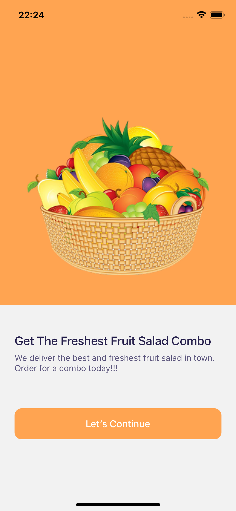
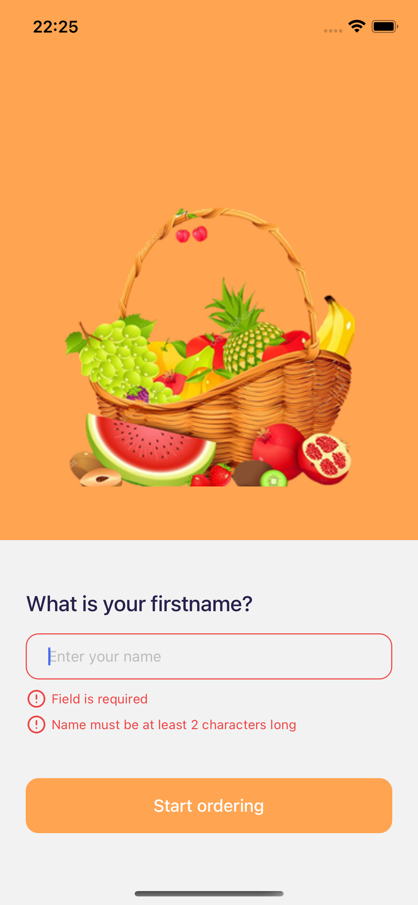
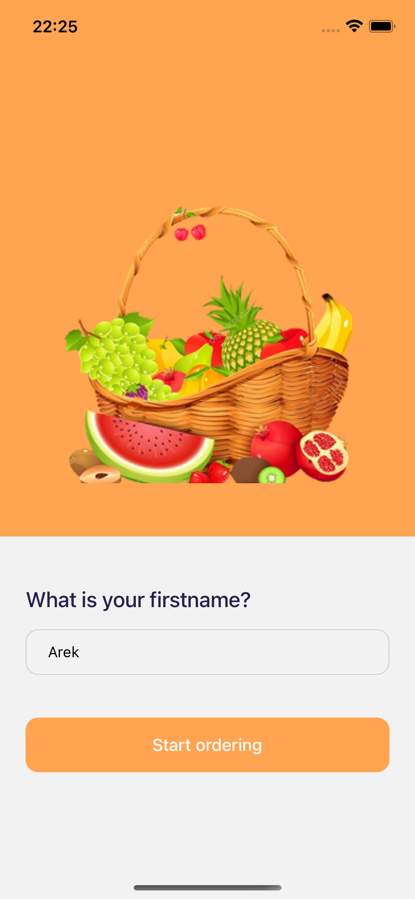
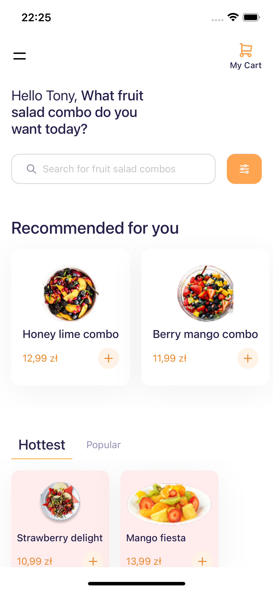
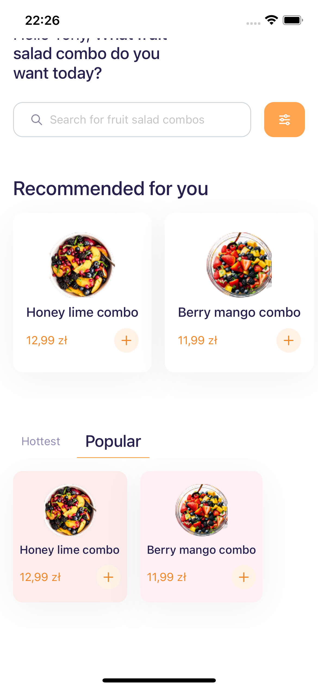
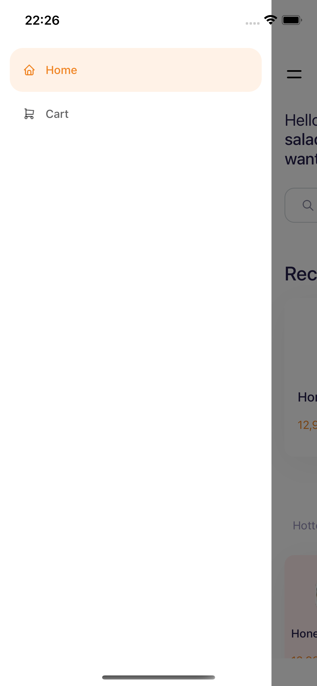

# 🍔 React Native Food Ordering UI

A clean and modern food ordering app UI built with **React Native**, featuring animated onboarding, drawer navigation,
and product listings with smooth scrollable FlatLists. Designed as a UI concept for mobile ordering platforms like Uber
Eats or Glovo.

## ✨ Features

- 🧭 **Onboarding** screens with modern layout and typography
- 🍱 **Home screen** with recommended dished section and tab section with hottest and popular dishes
- 📂 **Drawer navigation** for quick access to main views
- 🎨 Soft, pastel color palette with subtle shadows for elegant UI
- ⚡ Smooth user interaction via optimized FlatLists
- 🔠 Animated tab switching with font-size transitions

---

## 📸 Screenshots

<p float="left">
  
  
  
  
  
  
</p>

---

## 🚀 Getting Started

### 1. Clone the repository

```bash
git clone https://github.com/WlokaDev/react-native-shop.git
cd react-native-shop
yarn or npm install
expo start
```

## 🎨 UI Inspiration / Credits

The UI design and layout were inspired by
the [Mobile UI Kit – Ecommerce & Community](https://www.figma.com/design/TQ4qODI5LVHWdWRGoPA798/Mobile-UI-Kit--Ecommerce--Community-?node-id=47-3104&t=Wxzjq12qRCUZHtqr-0)
on Figma.

All code, structure, and animations were implemented independently in React Native for learning and portfolio purposes.